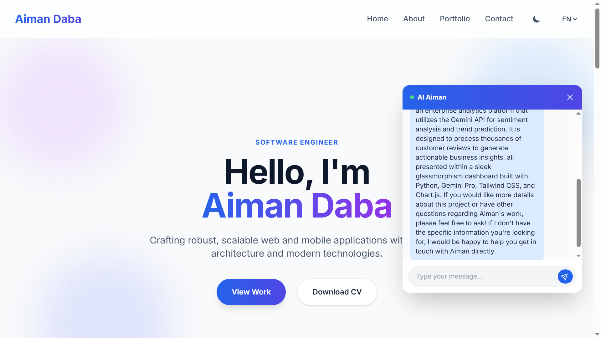
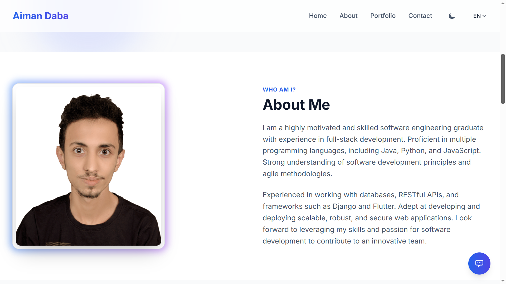
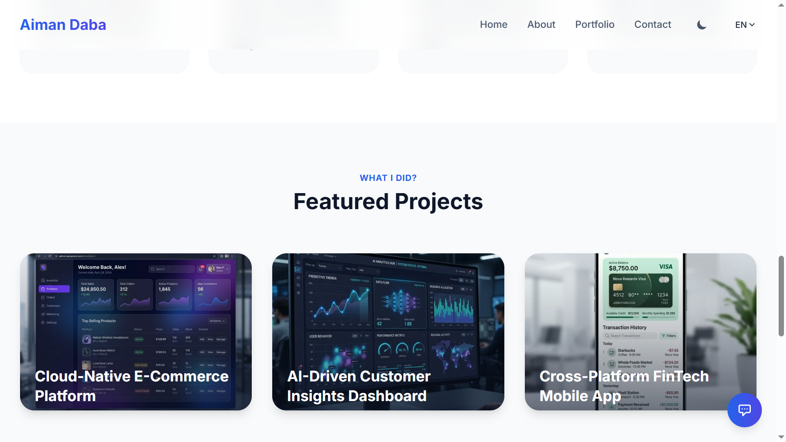
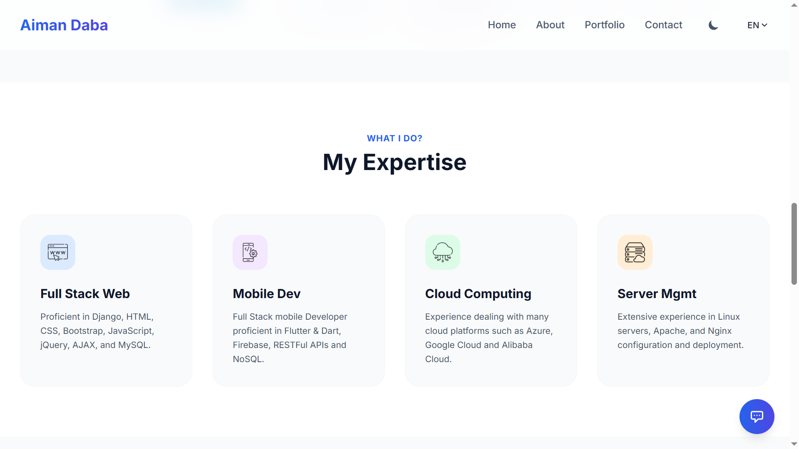
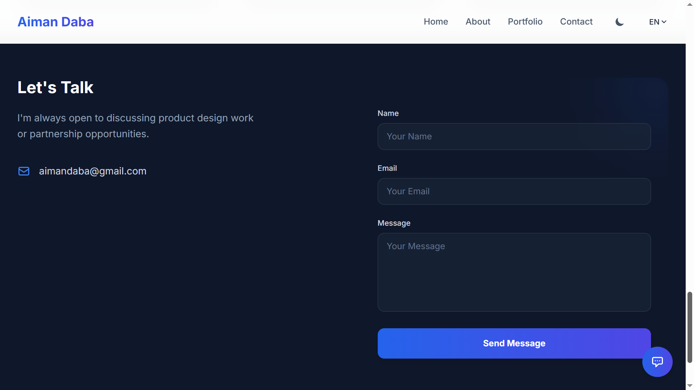

<h1 align="center">Aiman Daba - Elite Open-Source Portfolio 🚀</h1>

<p align="center">
  
  
  
  
  
</p>

A production-grade, highly-optimized showcase built with Django. Designed for elite architectural patterns, AI-integrated features, and superior UI/UX with global accessibility.

## ✨ Features

- **Modular Architecture**: Built with multiple apps (`core`, `portfolio`, `blog`, `api`) utilizing best practices.
- **Headless-Ready API**: Features a robust RESTful API built on the Django REST Framework.
- **AI Chatbot Service**: Powered by **Gemini 3.1 Flash**, providing intelligent, context-aware responses by analyzing the project portfolio and active CV data.
- **Glassmorphism Theme Engine**: A premium UI experience with Lottie micro-interactions, AOS.js animations, and persistent Dark/Light modes.
- **Global Accessibility (i18n)**: Comprehensive multi-language support (English LTR & Arabic RTL) for a global audience.
- **Automated Image Optimization**: Integrated pipeline that converts uploads to **WebP**, ensuring peak performance and a 100/100 Lighthouse score.
- **Real-Time GitHub Metrics**: Dynamic dashboard utilizing the **GitHub GraphQL API** to showcase live contribution data and language statistics with advanced error handling.
- **Production-Grade DevOps**: Robust deployment pipeline with multi-stage Docker builds and automated GitHub Actions CI.

## 🖼️ Screenshots

<p align="center">
  
  
</p>
<p align="center">
  
  
</p>
<p align="center">
  
</p>

## 🚀 Quick Deployment

Click the button below to deploy this application seamlessly via Render.

[](https://render.com/deploy)

## 🛠️ Local Installation

### Prerequisites
- Python 3.10+
- Docker & docker-compose

### Getting Started

1. **Clone the repository:**
   ```bash
   git clone https://github.com/Ai7mn/portfolio.git
   cd portfolio
   ```

2. **Configure Environment Variables:**
   Copy the example environment variables file and configure it as needed.
   ```bash
   cp .env.example .env
   ```

3. **Deploy using Docker Compose:**
   ```bash
   docker-compose up --build
   ```

4. **Run Migrations (if running locally without Docker):**
   ```bash
   python manage.py makemigrations
   python manage.py migrate
   ```

5. **Start Development Server:**
   ```bash
   python manage.py runserver
   ```
